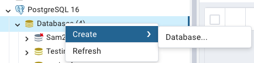
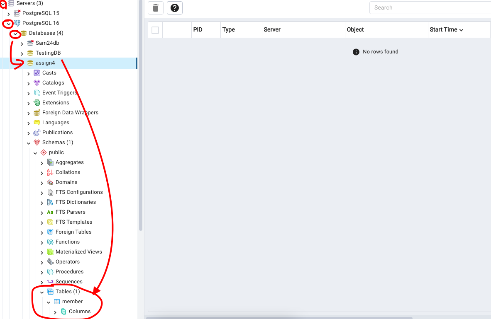

# Team7_Assignment4
Members : Vidit Naithani (vn9591), Zoe DeTrani (zd9575), Aayush Panchal (ap9115).

The purpose of this assignment is to create a web app that keeps track of anonymous users after the first user request. The users who access the system are verified through an authentication and authorization process.

# Architechture

# Set Up
## 1) PostGresSQL
Download : https://www.postgresql.org/download/
When it walks you through the main setup, please designate these fields to be:
Version = PostgreSQL 16
Port = 9000
Username = postgres
Password = rootpassword
After installing, open PgAdmin 4 and click the "> Servers" arrow button and connect to the PostgresSQL 16 server:
Right click on "Database" and create a database called "assign4"

Using the dropdown button, you'll see Schema. AFTER you run the program once, it will create a member's table as shown below.

## 2) Maven
Download: https://maven.apache.org/download.cgi (3.9.1 was compatiable with this project)

## 3) Springboot Configs
There will be some files you need to change:
application.properties (src/src/main/resources/application.properties):
Change the line from:

``spring.jpa.hibernate.ddl-auto=update``

to:

``spring.jpa.hibernate.ddl-auto=create``

This will create the member table after the first run. After the first run, please right click and refresh the assign4 database and check if the memebr table is created. 
IF it is created, change the line from "create" back to "update."

## Running the Program:
As mentioned before, please ensure your database settings, maven, and application.properties are set up.
1) Please run a ``mvn clean install`` in the terminal under the src/ folder where the pom.xml file is.
2) Run the application's main file: src/src/main/java/assign4/src/SrcApplication.java (make sure application.properties is set to "create" for the very frist run)
3) Open up the local host to run the app and you will see a login screen.
- Zoe: I ran this program on http://localhost:8080/
4) Before you run the program again, change the application.properties from "create" to "update"

## Architecture Breakers Identified:
(Detailed in the MemberController.java and Member.java files)
Authentication failure - Missing Model Attribute (TEST CASE 1):

Users will try to log in but if the user is not added to the model object of the spring boot controller, they will fail to login and be redirected back to the login page.

Authorization failure - Employee Submitting Task Form  (TEST CASE 2):

If an employee can submit a task form when only managers should have that privilege, it should cause an authorization failure. This is a flaw in how roles and permissions are assigned and checked. For HW4 we had a button only managers can select, however, with the architecture breaker, it allows anyone to select the button to create a task.

Password Encoder Not Applied During Login:

If the password encoder (Spring Security component) is not applied during login, it will try to compare an encoded password (from database) with the unencoded login password. 

Lack of Form Input Validation on the Task Creation Page

If there’s a null value or SQL injection entered into the form, it should not be allowed as a valid form input. It should contain correct user names, emails, etc. in order to be saved into the database. If the form does allow the submission of the null values, it’s an architecture breaker.